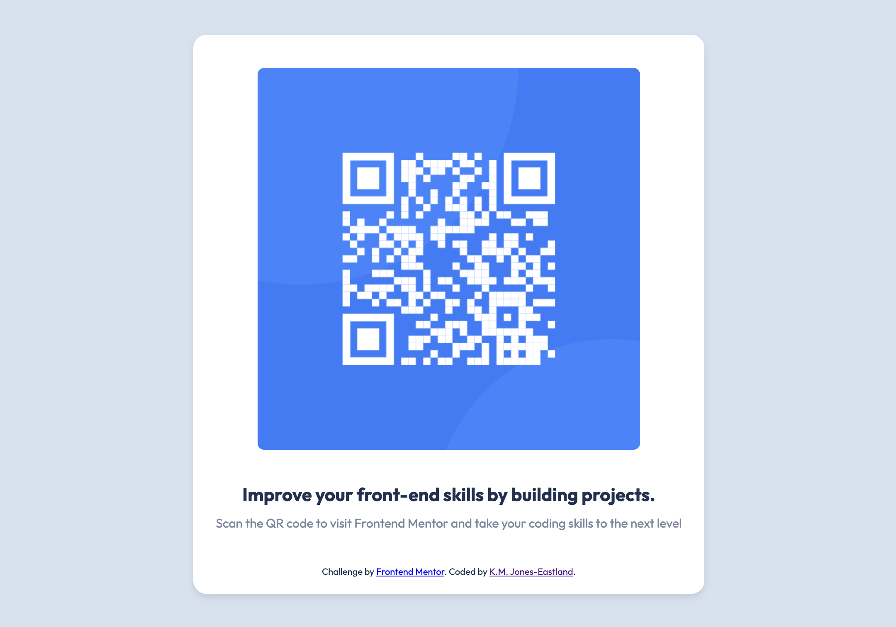

# Frontend Mentor - QR Code Component Solution

This project is my solution to the [QR code component challenge on Frontend Mentor](https://www.frontendmentor.io/challenges/qr-code-component-iux_sIO_H). Frontend Mentor challenges offer a practical way to improve coding skills by building realistic projects.



## Overview

### Links

- Solution URL: [GitHub Repository](https://github.com/kmje405/qr-code-component-main)
- Live Site URL: [Netlify Live Site](https://fem-qr-code-solution.netlify.app/)

### Built With

- Semantic HTML5 markup
- CSS custom properties
- Flexbox

### What I Learned

This project was a great opportunity to practice my HTML and CSS skills, especially focusing on layout techniques such as Flexbox. One of the key learnings was how to effectively use CSS custom properties to create a more manageable and maintainable stylesheet. Here's an example of CSS custom properties in action:

```css
:root {
  --dark-blue: hsl(218, 44%, 22%);
}

.card {
  color: var(--dark-blue);
}
```

### Continued Development

In future projects, I aim to further explore CSS Grid and responsive design techniques to build more complex layouts and ensure my projects are mobile-friendly.

### Author

Frontend Mentor - @kmje405

### Acknowledgments
I'd like to thank Frontend Mentor for providing this challenge. It was a great way to practice and solidify my front-end development skills.